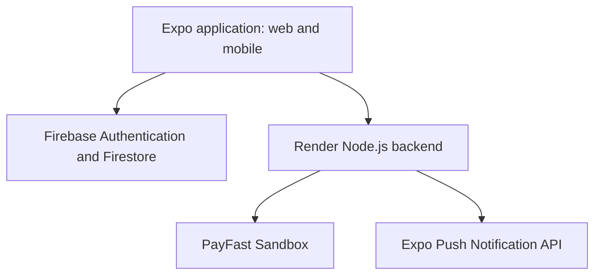

# TCS Parent Portal

A full-stack parent and staff communication portal for **Thabazimbi Christian School**. The application provides separate experiences for parents, teachers, and administrators, including learner information, school communication, fee statements, PayFast payments, notifications, and administrative management.

## Live deployment

| Service | URL | Purpose |
|---|---|---|
| Frontend web app | https://tcs-parent-portal-web.onrender.com | Browser-accessible Expo version of the portal |
| Login page | https://tcs-parent-portal-web.onrender.com/login | Live login screen |
| Backend API | https://tcs-parent-portal-render.onrender.com | Render-hosted Node.js backend |
| Backend health check | https://tcs-parent-portal-render.onrender.com/.netlify/functions/health | Confirms that the backend is running |
| Firebase health check | https://tcs-parent-portal-render.onrender.com/.netlify/functions/firebase-health | Confirms Firebase Admin connectivity |
| PayFast health check | https://tcs-parent-portal-render.onrender.com/.netlify/functions/payfast-health | Confirms PayFast Sandbox configuration |

> PayFast is currently configured for Sandbox testing. No real payments should be processed through the demo environment.

## System overview



The same Expo codebase supports:

- A native mobile experience through Expo Go.
- A live browser demo hosted as a Render Static Site.
- A Node.js backend hosted separately as a Render Web Service.

The frontend calls the backend through the deployed Render URL. Backend routes retain the `/.netlify/functions/...` path format for compatibility with the existing application, but they are now served by Express on Render.

## Key features

### Parent portal

- Secure sign-in using school-managed accounts.
- View learner information, reports, news, calendar items, appointments, and messages.
- View fee statements and initiate PayFast payments.
- Receive relevant school, finance, academic, and content notifications.
- Manage profile and language preferences.

### Teacher portal

- View linked classes and learners.
- Record and manage academic information.
- Publish news, calendar items, appointments, and learner-related updates.
- Communicate with parents through the portal.

### Administrator portal

- Create and manage parent, teacher, and administrator accounts.
- Manage classes, learners, and user links.
- Issue fee statements and record payments.
- Compile and review reports.
- Manage school news, calendars, and requests.

## Technology stack

| Area | Technology |
|---|---|
| Mobile and web frontend | Expo SDK 57, React Native, Expo Router, TypeScript |
| Web export | Expo static web export |
| Backend | Node.js, Express, TypeScript |
| Authentication and database | Firebase Authentication, Cloud Firestore, Firebase Admin |
| Payments | PayFast Sandbox |
| Notifications | Expo Notifications and Expo Push API |
| Hosting | Render Static Site and Render Web Service |
| Source control | GitHub |
| Continuous integration | GitHub Actions |

## Repository structure

```text
TCS-Parent-Portal/
├── mobile/                     # Expo React Native and web frontend
│   ├── src/app/                # Expo Router screens and routes
│   ├── .env.example            # Public frontend variable template
│   └── package.json
├── backend/                    # Express compatibility backend
│   ├── netlify/functions/      # Existing serverless-style handlers
│   ├── server.ts               # Express server and function router
│   ├── .env.example            # Backend variable template
│   └── package.json
├── .github/workflows/ci.yml    # GitHub Actions quality checks
└── README.md
```

## Local setup

### Prerequisites

- Node.js 22 or later
- npm
- Expo Go for native-device testing
- Firebase project access
- PayFast Sandbox credentials for backend payment testing

### Clone and install

```bash
git clone https://github.com/ST10385429/tcs-parent-portal-render.git
cd tcs-parent-portal-render
```

### Frontend

```bash
cd mobile
npm ci
npm start
```

To run the browser version locally:

```bash
npm run web
```

To create a production web export:

```bash
npm run build:web
```

Expo exports the static web files to `mobile/dist`.

### Backend

Open a second terminal:

```bash
cd backend
npm ci
npm run check
npm run build
npm start
```

The backend runs locally at:

```text
http://localhost:10000
```

Example local health check:

```text
http://localhost:10000/.netlify/functions/health
```

## Environment variables

Environment files must never be committed. Copy the example files and add values locally:

```bash
copy mobile\.env.example mobile\.env
copy backend\.env.example backend\.env
```

### Frontend variables

Only client-safe values prefixed with `EXPO_PUBLIC_` belong in `mobile/.env`.

```text
EXPO_PUBLIC_FIREBASE_API_KEY
EXPO_PUBLIC_FIREBASE_APP_ID
EXPO_PUBLIC_FIREBASE_AUTH_DOMAIN
EXPO_PUBLIC_FIREBASE_MESSAGING_SENDER_ID
EXPO_PUBLIC_FIREBASE_PROJECT_ID
EXPO_PUBLIC_FIREBASE_STORAGE_BUCKET
EXPO_PUBLIC_PAYFAST_BACKEND_URL
```

### Backend variables

Backend-only credentials belong in `backend/.env` locally and in Render environment variables for production.

```text
FIREBASE_PROJECT_ID
FIREBASE_CLIENT_EMAIL
FIREBASE_PRIVATE_KEY
PAYFAST_MERCHANT_ID
PAYFAST_MERCHANT_KEY
PAYFAST_PASSPHRASE
PAYFAST_PROCESS_URL
PAYFAST_SANDBOX
PAYMENT_CANCEL_SECRET
PUBLIC_BACKEND_URL
```

## Security approach

- Firebase Authentication controls user sign-in.
- Firestore Security Rules control client access to application data.
- Firebase Admin credentials remain backend-only.
- PayFast merchant credentials and passphrases remain backend-only.
- Payment cancellation links use an HMAC-based cancellation token.
- Environment files, `node_modules`, and build output are excluded from Git.
- The frontend only receives `EXPO_PUBLIC_` configuration values required to connect to Firebase and the deployed backend.
- The Render backend enables CORS so the deployed frontend can call supported API routes.

## Testing and quality checks

### Mobile quality checks

```bash
cd mobile
npm run check
```

This runs:

- TypeScript validation
- Expo linting

### Backend quality checks

```bash
cd backend
npm run check
npm run build
```

This runs:

- TypeScript validation
- Automated backend tests
- Production TypeScript build

The backend automated test suite currently verifies utility and validation behaviour, including string handling, currency rounding, and Expo push-token validation.

### Live verification

The deployed system has been verified through:

- Render backend health endpoint
- Firebase health endpoint
- PayFast Sandbox health endpoint
- Live PayFast Sandbox payment flow
- Live notification flow
- GitHub Actions quality pipeline
- Render-hosted web login and dashboard navigation

## CI/CD pipeline

GitHub Actions runs automatically on pushes to:

- `main`
- `develop`
- `feature/**`

It also runs for pull requests targeting `main` or `develop`.

The pipeline performs:

1. Mobile TypeScript and Expo lint checks.
2. Backend TypeScript checks and automated tests.
3. Backend production build verification.
4. A final quality-gate job after the mobile and backend jobs succeed.

Render is connected to the `main` branch and automatically redeploys the linked services when relevant code changes are pushed.

## Deployment architecture

| Service | Render type | Root directory | Build command | Output |
|---|---|---|---|---|
| Backend | Web Service | `backend` | `npm install && npm run build` | Express server |
| Frontend | Static Site | `mobile` | `npm ci && npm run build:web` | `dist` |

## Browser and mobile behaviour

The live Render frontend demonstrates the same portal interface and business flows as the Expo application.

Native push notification registration is best demonstrated through Expo Go on a mobile device. The web build can display the portal and its data-driven features, but Expo reports limited support for push-token change listeners in web browsers.

## Suggested collaboration workflow

```text
feature/<feature-name>
        ↓
develop
        ↓
main
        ↓
GitHub Actions checks and Render deployment
```

- Use `feature/...` branches for focused work.
- Merge reviewed work into `develop`.
- Merge tested releases into `main`.
- Keep `.env` files and all private credentials out of Git commits.

## Demonstration evidence

For assessment and presentation evidence, capture:

- GitHub Actions with all jobs passing.
- Render showing both frontend and backend services deployed.
- The hosted login page and a role dashboard.
- Backend health, Firebase health, and PayFast health responses.
- A PayFast Sandbox payment and corresponding notification.
- The architecture diagram and live deployment links in this README.